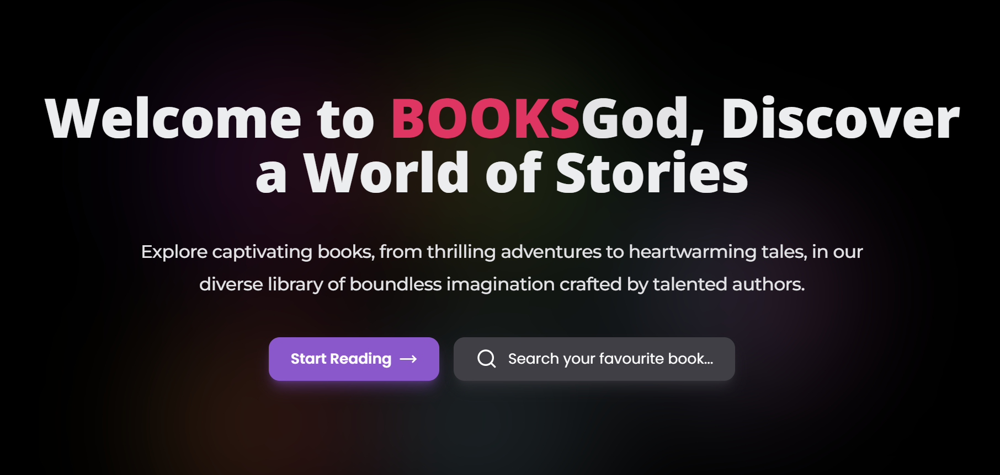

# BooksGod


**BooksGod** is a Next.js application designed for managing and exploring books. It incorporates the latest features and best practices of Next.js 14, providing a comprehensive platform for both readers and authors. Below is an overview of its features and technologies.

## Overview

**About:**
This is a side project of mine aimed at implementing and understanding the latest Next.js features and best practices. Users can log in, search for books, read, and register as authors to write their own books. Authors can utilize the provided editor to write, save drafts, and publish. It supports book cover uploads, details, and allows paid book purchases for users.

## Features

- React server components
- TRPC
- Reader for reading books
- Editor for writing books
- User friendly dashboard
- Docs for authors using contentlayer
- Image upload with AWS S3
- Filter options for books
- Search with infinite pagination
- Community for users and authors
- Optimistic updates
- Redis caching
- Authentication using Clerk
- Validations using zod
- Drizzle ORM
- Database - PlanetScale
- Rate Limiting
- Book Purchasing with Stripe
- Loading States using Suspense
- UI component library - NextUi
- Styled using Tailwind CSS
- Deployed on Vercel Edge

## To-Do List:

- Documentation for Authors
- More Author Features
- Auto-Save Editor Functionality
- Reading Preferences

## Installation

1. Install dependencies:

   ```sh
   pnpm install
   ```

2. Copy `.env.example` to `.env.local` and update the variables:

   ```sh
   cp .env.example .env.local
   ```

3. Start the development server:

   ```sh
   pnpm dev
   ```
